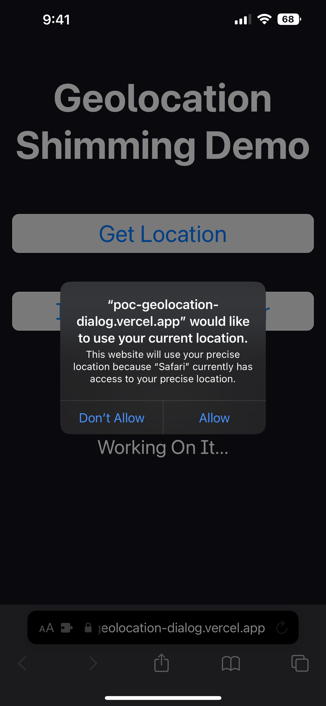
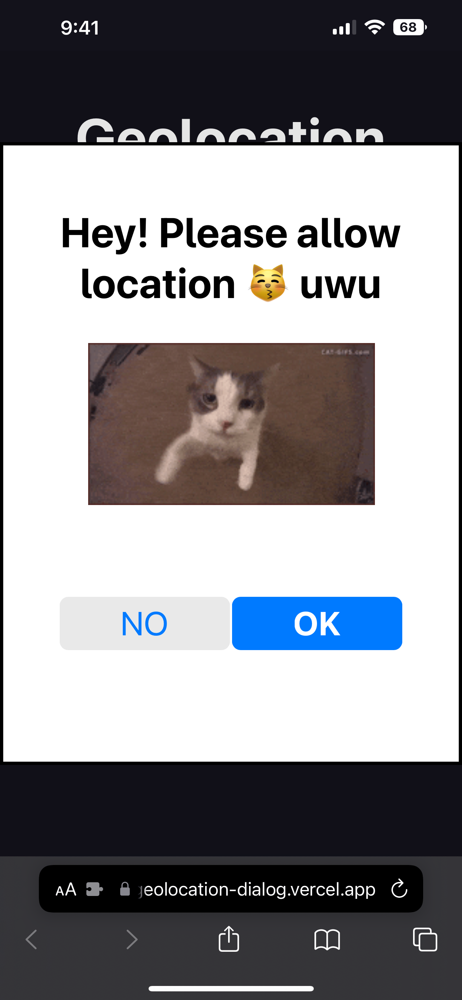

# Geolocation Shimming Demo

This is a proof of concept that you can shim geolocation APIs with JavaScript.

```js
const navigator = {
  geolocation: {
    getCurrentPosition(success, error) {
      // do some random stuff...
    },
  },
}
```

| Vanilla                        | Shimmed                        |
| ------------------------------ | ------------------------------ |
|  |  |
